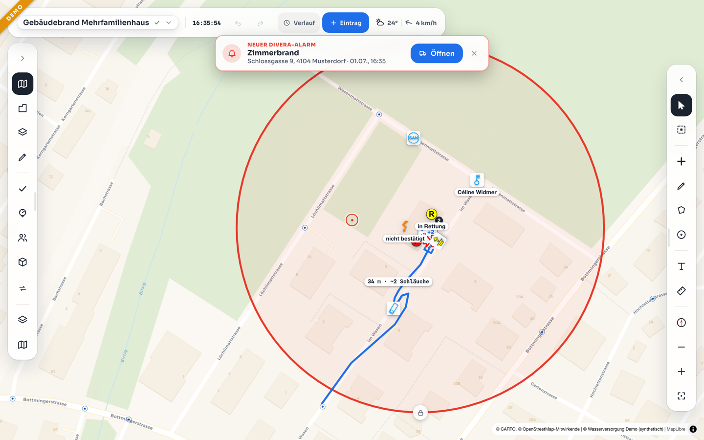
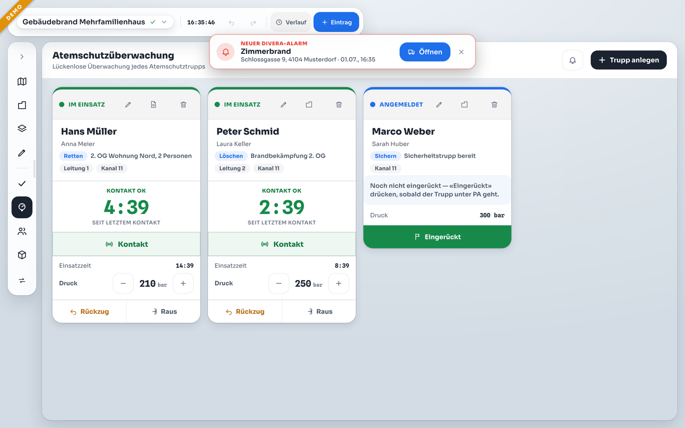
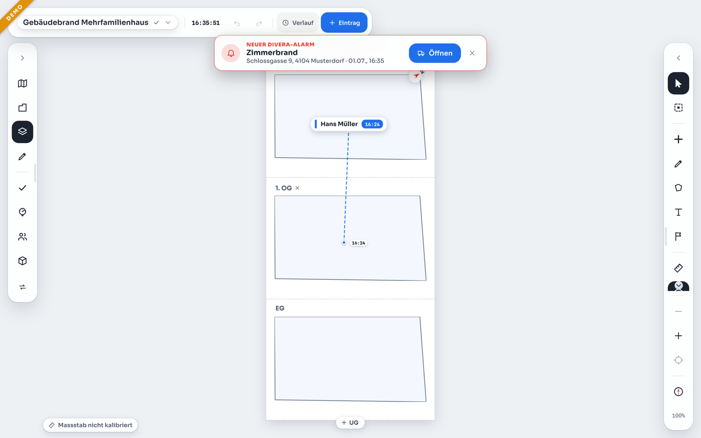
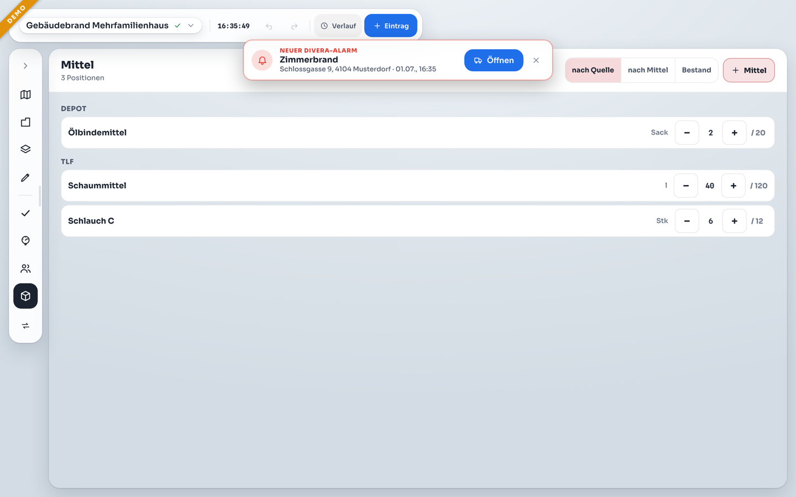
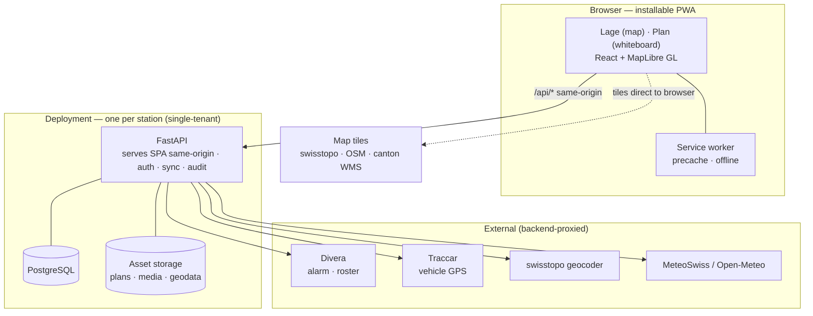

# KP Front

**Einsatzführungs-app for frontline fire-service command.** KP Front replaces the physical
Lagekarte and command table with a shared situation map, prepared plans and object data, live
documentation, and an offline-capable record.

One operator runs it on a consumer tablet and can share it with the command point using screen
mirroring or display mode. KP Front owns its incident state, map, timeline, offline cache, and
exports; integrations add data but are not required to operate it.

## Try the demo

The [public demo](https://kp-front-demo.up.railway.app) contains a running Gebäudebrand in
fictional Musterdorf. Credentials are shown on the login screen, and the demo resets every two
hours.

The repository includes the same synthetic station dataset in
[`examples/demo-data/`](examples/demo-data/). No real station data is bundled.

| Lage — live command picture | Atemschutz — SCBA teams on the clock |
| --- | --- |
|  |  |
| **Gebäude — floor stack and AGT tracking** | **Mittel — material use by source** |
|  |  |

## Why KP Front

KP Front grew out of a Swiss Milizfeuerwehr command point. It is designed around **one
station, one incident, one operator**, not scaled down from dispatch-center software.

- **Built for Swiss practice.** FKS-style tactical symbols, swisstopo maps and geocoding,
  LV95 coordinates, and optional Divera, Traccar, hydrant, and cadastre data.
- **Offline-first.** Field data is cached, readiness is verified, and edits sync when the
  connection returns.
- **One command surface.** Lage, Plan, Verlauf, Atemschutz, Mannschaft, Mittel, and reporting
  share consistent controls.
- **Made for 3am.** Recognition over recall, safe defaults, large touch targets, and undo for
  mutable actions.
- **Defensible records.** Verlauf and audit events are append-only; corrections become new
  entries.
- **Open and self-hostable.** One AGPL-licensed service per station, with no per-seat licence.

## Highlights

- **Lage:** MapLibre map, tactical symbols, drawing, sectors, radii, notes, photos, and audio.
- **Plan:** Image-backed whiteboards with symbols, resources, scale calibration, and measurement.
- **Einsatz-Intake:** Guided incident creation from Divera, an address, an object, or the map.
- **Atemschutz:** Trupp setup, pressure and return estimates, alarms, map links, and logging.
- **Mannschaft:** Divera or manual attendance, roster, and assignments.
- **Reference data:** ADR lookup, wind, hydrants, utility lines, and Traccar vehicle positions.
- **Resilience:** Undo/redo, append-only records, sync status, offline readiness, and day/night UI.

See [`CHANGELOG.md`](CHANGELOG.md) for the feature history. Planned work lives in
[GitHub issues](https://github.com/feuerwehr-oberwil/kp-front/issues) and
[discussions](https://github.com/feuerwehr-oberwil/kp-front/discussions).

## Status

KP Front is in operational use at Feuerwehr Oberwil and under active development. Each
single-tenant deployment supplies its own branding, maps, fleet, doctrine, object plans,
geodata, and checklists.

The [`station data guide`](docs/STATION-DATA.md) shows how to build a field-ready private data
repository from the synthetic example without access to Feuerwehr Oberwil's private data.

Interested in using or contributing to KP Front? Start a
[GitHub discussion](https://github.com/feuerwehr-oberwil/kp-front/discussions) or email
[bastian@eichenbergers.ch](mailto:bastian@eichenbergers.ch).

## Quick start

Recipes use [`just`](https://github.com/casey/just) (`brew install just`). See the
[`justfile`](justfile) for the underlying commands.

### Frontend only

Run the interface with built-in demo data:

```bash
just install && just dev        # http://localhost:5188
```

### Full development stack

```bash
just setup       # install dependencies
just db          # start PostgreSQL on localhost:5434
just demo-load   # load the optional Musterdorf dataset
just api         # start the API on localhost:8000
just dev         # start the frontend on localhost:5188
```

Log in with the seeded default editor — user `fu` (Führungsunterstützung), PIN `000000`
(from `backend/app/seed_users.json`; change it after first login).

### Self-host

The production setup uses one application container and PostgreSQL. See the full
[`deployment guide`](docs/DEPLOYMENT.md).

```bash
just init-env
docker compose up -d --build
```

### Common recipes

Run `just` without an argument to list every recipe.

| Recipe | Purpose |
| --- | --- |
| `just dev` / `just api` | frontend / backend dev servers |
| `just lint` / `just test` | lint / test both stacks |
| `just build` | type-check + production build |
| `just config-example` | print a starting deployment config (copy & edit) |
| `just config-validate <file>` / `just config-load <file>` | validate / apply a config |
| `just demo-load` | load the synthetic Musterdorf demo dataset |

The React frontend can run alone. The FastAPI backend adds authentication, workspace sync,
history, integrations, and reference data. Deployment configuration is managed as code; see
[`Configuration`](docs/CONFIGURATION.md) and [`API`](docs/API.md).

## Architecture & key decisions

A tablet-first PWA talks to a single FastAPI service that serves the app same-origin, owns the
database and asset store, and is the only thing that reaches external services — one deployment
per station. Full diagrams (data provenance, backend modules, config layers, sync flow) are in
[`docs/ARCHITECTURE.md`](docs/ARCHITECTURE.md).



**Frontend:** React 18, TypeScript, Vite 5, MapLibre GL, Workbox/PWA, and Vitest. Incident
workspaces persist in IndexedDB and sync with the backend when online.

**Backend:** FastAPI, PostgreSQL, Alembic, and `uv`. It serves the frontend from the same origin,
supports Railway and Docker Compose deployments, and uses PIN-based `editor` and `viewer` roles.

**Configuration layers** (see [`Configuration`](docs/CONFIGURATION.md)):

1. National defaults in code.
2. Per-station configuration in the database.
3. Secrets in environment variables.
4. Per-incident settings in the workspace.

**Deliberate tradeoffs:**

- **Single-tenant:** one station per deployment keeps ownership and isolation simple.
- **Task-scoped sync:** collections merge by item; simultaneous edits to one item use a simple
  conflict model.
- **Append-only history:** operational records are corrected with new events, not rewritten.
- **Verified offline readiness:** the app checks required cached data instead of assuming it is
  available.

**The 3am tenet** — the guiding UX rule across every feature: the operator is an infrequent
expert, under stress, possibly in the dark and offline, who must use this correctly at 3am
after six months without practice. Recognition over recall, right defaults over
configuration, nothing that can't be undone.

## Known limitations

- Offline persistence requires IndexedDB; restricted browser modes may fall back to less durable
  storage.
- Simultaneous edits to the same object can overwrite one another.
- Workspace data has a schema version but is not yet validated and migration-gated on load.

See [GitHub issues](https://github.com/feuerwehr-oberwil/kp-front/issues) for current work.

## Repository layout

```text
src/                       React/Vite frontend
  components/              UI surfaces
  config/                  copy, locale, defaults, and storage keys
  data/                    neutral fallback data
  lib/                     domain logic, offline storage, and sync
backend/                   FastAPI/PostgreSQL service
examples/demo-data/        synthetic Musterdorf deployment data
public/                    tactical symbols and PWA assets
tools/                     symbol generator and source assets
docs/                      product and technical documentation
```

## Documentation

Start with the [`documentation index`](docs/README.md):

- [`Configuration`](docs/CONFIGURATION.md) — deployment configuration and station data.
- [`Station data`](docs/STATION-DATA.md) — build and load a private station-data repository.
- [`Deployment`](docs/DEPLOYMENT.md) — production and self-hosted setup.
- [`Architecture`](docs/ARCHITECTURE.md) — system overview and design decisions.

## Related project

KP Front runs the **frontline** command surface — the Lagekarte. If you're looking for the
**rear** command post — a Kanban resource board that replaces the physical magnet board for
tracking personnel, vehicles, materials, and incidents — see its companion
**[KP Rück](https://github.com/feuerwehr-oberwil/kp-rueck)**
([live demo](https://kp-rueck-demo.up.railway.app/)).

The two grew out of the same brigade and share a design language, but they are **completely
independent** codebases and deployments — neither requires the other. They can *optionally* hand
alarms to each other through the same generic `POST /api/alarms` webhook, and nothing more.

## License

KP Front is licensed under the **GNU Affero General Public License v3.0 or later**
(`AGPL-3.0-or-later`) — see [`LICENSE`](LICENSE). You may run, study, share, and modify it; if
you run a modified version as a network service, you must offer your users the modified source.

Copyright © 2026 Bastian Eichenberger.

The AGPL covers the application source and the KP-Front-authored tactical symbol pack.
Station-specific object plans, geodata, and checklists are supplied separately by each
deployment and are not part of this repository.
