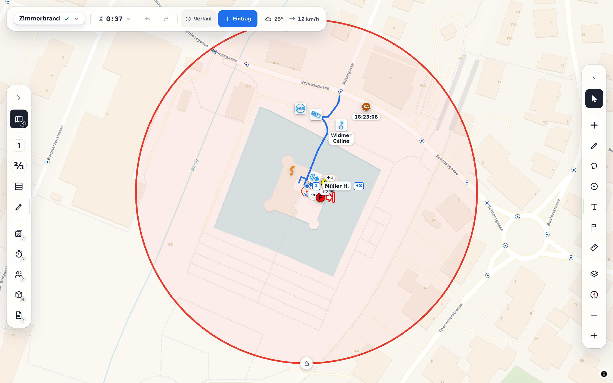
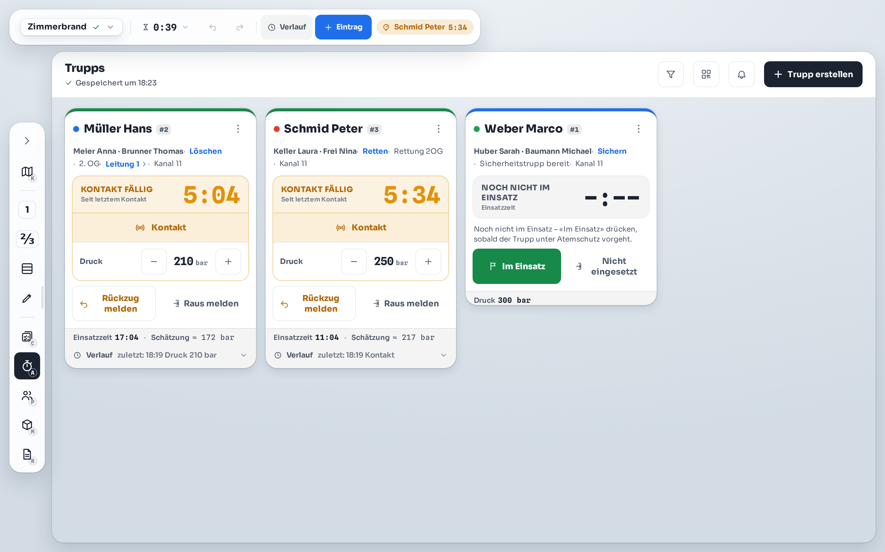
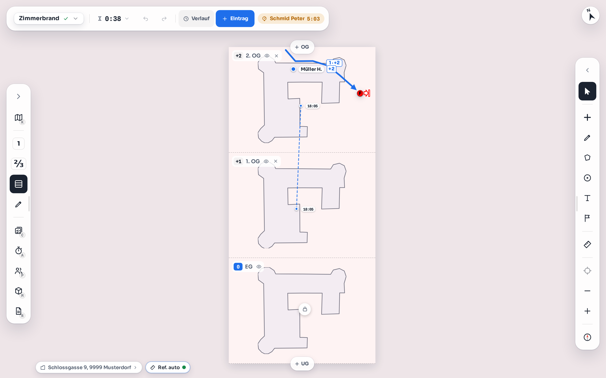
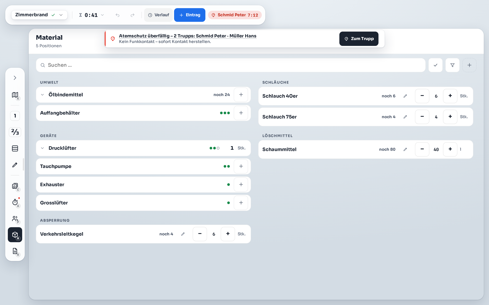
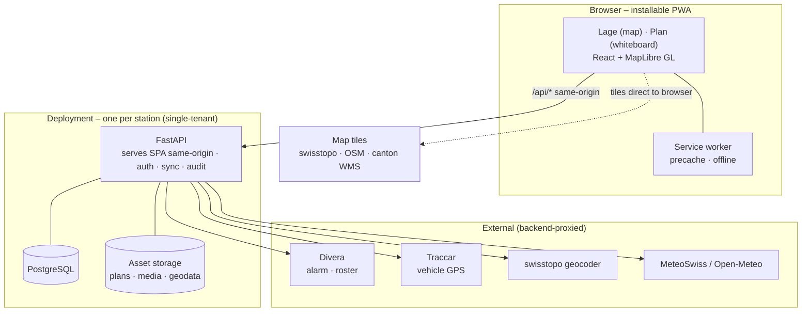

# KP Front

[](https://www.gnu.org/licenses/agpl-3.0)
[](https://github.com/feuerwehr-oberwil/kp-front/actions/workflows/ci.yml)
[](https://demo.kp-front.ch)

**Einsatzführungs-app for frontline fire-service command.** KP Front replaces the physical
Lagekarte and command table with a shared situation map, prepared plans and object data, live
documentation, and an offline-capable record.

One operator runs it on a consumer tablet and can share it with the command point using screen
mirroring or display mode. KP Front owns its incident state, map, timeline, offline cache, and
exports; integrations add data but are not required to operate it.

## Try the demo

The [public demo](https://demo.kp-front.ch) contains a running Zimmerbrand at the
Schloss in fictional Musterdorf. Credentials are shown on the login screen, and the demo resets
every twelve hours (00:00 and 12:00 Europe/Zurich) – edits persist until the next reset.

The repository includes the same synthetic station dataset in
[`examples/demo-data/`](examples/demo-data/). No real station data is bundled.

| Lage – live command picture | Atemschutz – SCBA teams on the clock |
| --- | --- |
|  |  |
| **Gebäude – floor stack and AGT tracking** | **Mittel – material use by source** |
|  |  |

## Why KP Front

KP Front grew out of a Swiss Milizfeuerwehr command point. It is designed around **one
station, one incident, one operator**, not scaled down from dispatch-center software.

- **Built for Swiss practice.** FKS-style tactical symbols, swisstopo maps and geocoding,
  LV95 coordinates, and optional Divera, Traccar, hydrant, and cadastre data.
- **Offline-first.** Field data is cached, readiness is verified, and edits sync when the
  connection returns.
- **One command surface.** Lage, Plan, Verlauf, Atemschutz, Mannschaft, Mittel, and reporting
  share consistent controls.
- **Made for 3am.** Recognition over recall, safe defaults, large touch targets, and undo for
  mutable actions.
- **Defensible records.** Verlauf and audit events are append-only; corrections become new
  entries.
- **Open and self-hostable.** One AGPL-licensed service per station, with no per-seat licence.

## Highlights

- **Lage:** MapLibre map, tactical symbols, drawing, sectors, radii, notes, photos, and audio.
- **Plan:** Image-backed whiteboards with symbols, resources, scale calibration, and measurement.
- **Einsatz-Intake:** Guided incident creation from Divera, an address, an object, or the map.
- **Atemschutz:** Trupp setup, pressure and return estimates, alarms, map links, and logging.
- **Mannschaft:** Divera or manual attendance, roster, and assignments.
- **Zeitplan:** Shift planning for long incidents – availability and assignment per person, a
  coverage curve across the span, printable as the «Zeitplan» Führungsformular.
- **Reference data:** ADR lookup, wind, hydrants, utility lines, and Traccar vehicle positions.
- **Wiedergabe:** Scrub back through an incident as it unfolded – the map, the Verlauf and the
  attendance at any point in time, from the same append-only record the Rapport is built from.
- **Statistik-Export:** Aggregate incident data for the annual report, with WinFAP matching –
  see [`docs/STATS-EXPORT.md`](docs/STATS-EXPORT.md).
- **Resilience:** Undo/redo, append-only records, sync status, offline readiness, and day/night UI.

See [`CHANGELOG.md`](CHANGELOG.md) for the feature history. Planned work lives in
[GitHub issues](https://github.com/feuerwehr-oberwil/kp-front/issues) and
[discussions](https://github.com/feuerwehr-oberwil/kp-front/discussions).

## Status

KP Front is in operational use at Feuerwehr Oberwil and under active development. Each
single-tenant deployment supplies its own branding, maps, fleet, doctrine, object plans,
geodata, and checklists.

The [`station data guide`](docs/STATION-DATA.md) shows how to build a field-ready private data
repository from the synthetic example without access to Feuerwehr Oberwil's private data.

Interested in using or contributing to KP Front? Start a
[GitHub discussion](https://github.com/feuerwehr-oberwil/kp-front/discussions) or email
[bastian@eichenbergers.ch](mailto:bastian@eichenbergers.ch).

## Quick start

**Setting up a station, not hacking on the code? Skip to [Self-host](#self-host)** – this
section is the developer machine.

Recipes use [`just`](https://github.com/casey/just) (`brew install just`). See the
[`justfile`](justfile) for the underlying commands.

### Development stack

```bash
just setup       # install dependencies (once)
just demo-load   # load the optional Musterdorf dataset (starts the DB; migrates first)
just demo-off    # ← run this after demo-load, or you cannot create incidents (see below)
just dev         # PostgreSQL + API (:8001) + frontend (:5188), Ctrl+C stops all
```

> **`just demo-off` is not optional after `just demo-load`.** The demo dataset sets
> `demoMode: true`, which makes `POST /api/incidents` answer **403** — the guard that keeps the
> public demo read-only. On your own machine that just looks like a broken app, so turn it off
> once the data is loaded. Re-run it after every `just demo-load`.

`just dev` is the only command you need day to day – it starts the database, waits for it,
migrates, and runs both servers in one terminal. For the frontend alone (no database, no
backend, built-in demo data): `pnpm dev`.

Log in with the seeded default editor – user `fu` (Führungsunterstützung), PIN `000000`
(from `backend/app/seed_users.json`; change it after first login).

### Common recipes

Run `just` without an argument to list every recipe.

| Recipe | Purpose |
| --- | --- |
| `just dev` | the whole stack: database + backend + frontend |
| `just db-stop` / `just db-reset` | stop the dev database / wipe its volume |
| `just lint` / `just test` | lint / test both stacks |
| `just build` | type-check + production build |
| `just config-example` | print a starting deployment config (copy & edit) |
| `just config-validate <file>` / `just config-load <file>` | validate / apply a config |
| `just demo-load` | load the synthetic Musterdorf demo dataset (then run `just demo-off`) |
| `just demo-off` | clear `demoMode`, so incidents can be created locally |

The React frontend can run alone. The FastAPI backend adds authentication, workspace sync,
history, integrations, and reference data. Deployment configuration is managed as code; see
[`Configuration`](docs/CONFIGURATION.md) and [`API`](docs/API.md).

## Self-host

The production setup is one application container and PostgreSQL, pulled as a published
image – no build toolchain on the server. Setting up a station for the first time? Follow
[`docs/SETUP.md`](docs/SETUP.md), which walks the whole path in order; the full
[`deployment guide`](docs/DEPLOYMENT.md) is the reference behind it.

```bash
git checkout "$(git tag -l 'v*' --sort=-v:refname | head -n1)"   # newest release, not main
./scripts/setup.sh            # ghcr.io/feuerwehr-oberwil/kp-front:${KP_FRONT_TAG:-latest}
```

`setup.sh` is plain bash and docker – **a station server never needs `just`, `uv` or `pnpm`**,
and the recipes above are the developer toolchain, not the install. It asks for your domain, the
host port and whether to back the station up nightly, checks the port is free *before* anything
starts, generates all four secrets, waits until the app answers, and then mints the Web Push pair
and the two webhook secrets into the encrypted credential store – so they stay rotatable in
`/admin` instead of frozen in `.env`. `just self-host` runs the identical script.

**Getting your data in.** A fresh deployment is meant to be run empty – swisstopo base map, no
layers, no plans, no roster, and nothing errors – then filled in whichever way suits you. There are
two doors, and it is worth knowing which is which:

- **Manifest + `admin_*` CLI, or the same thing one file at a time in the admin UI.** These are
  not alternatives to "the JSON files" – *the manifest is what the CLI reads*. All of them write
  through one code path, so the browser and the CLI mint the same dataset ids and cannot drift.
- **A scheduled pull from an S3-compatible bucket** – the only option where no other system needs
  a credential for this one. ⚠️ Covers **object plans only**; geodata and checklists are CLI or UI.

Both doors are built in – the pull is a first-class feature reading any S3-compatible bucket with a
documented index, not a bridge to some particular product.

Either way the bytes land in **your** deployment's storage and are served from there; a bucket is a
source, not a runtime dependency. WMS layers store nothing at all – the browser fetches cantonal
tiles directly. Roster and incidents are a separate axis, covered by the integrations below.

Oberwil regenerates its manifests nightly from a plan library, but **that pipeline is not part of
this product** – `admin_objects schema` and `admin_objects example` give you the contract, and four
PDFs uploaded by hand once a year is a complete answer. The full walkthrough is
[`docs/SETUP.md` §4](docs/SETUP.md).

Updating is `docker compose pull && docker compose up -d`; migrations run on boot. Pin a
version with `KP_FRONT_TAG` in `.env` and follow the
[releases](https://github.com/feuerwehr-oberwil/kp-front/releases) –
[`CHANGELOG.md`](CHANGELOG.md) explains what a MAJOR/MINOR/PATCH bump means for a deployment.

**Every published image has already run a real fire station.** Feuerwehr Oberwil's production
deployment and the public demo both track `main` continuously; a version tag is a label on a
commit that has been carrying live incidents. Releases exist for *other* stations, not for us.

## Architecture & key decisions

A tablet-first PWA talks to a single FastAPI service that serves the app same-origin, owns the
database and asset store, and is the only thing that reaches external services – one deployment
per station. Full diagrams (data provenance, backend modules, config layers, sync flow) are in
[`docs/ARCHITECTURE.md`](docs/ARCHITECTURE.md).


```mermaid
flowchart TB
  subgraph CLIENT["Browser – installable PWA"]
    UI["Lage (map) · Plan (whiteboard)<br/>React + MapLibre GL"]
    SW["Service worker<br/>precache · offline"]
    UI --- SW
  end
  subgraph DEP["Deployment – one per station (single-tenant)"]
    API["FastAPI<br/>serves SPA same-origin · auth · sync · audit"]
    DB[("PostgreSQL")]
    FILES[("Asset storage<br/>plans · media · geodata")]
    API --- DB
    API --- FILES
  end
  subgraph EXT["External (backend-proxied)"]
    DIV["Divera<br/>alarm · roster"]
    TRC["Traccar<br/>vehicle GPS"]
    GEO["swisstopo geocoder"]
    WX["MeteoSwiss / Open-Meteo"]
  end
  TILES["Map tiles<br/>swisstopo · OSM · canton WMS"]
  UI -->|"/api/* same-origin"| API
  API --> DIV
  API --> TRC
  API --> GEO
  API --> WX
  UI -. "tiles direct to browser" .-> TILES
```

**Frontend:** React 18, TypeScript, Vite 5, MapLibre GL, Workbox/PWA, and Vitest. Incident
workspaces persist in IndexedDB and sync with the backend when online.

**Backend:** FastAPI, PostgreSQL, Alembic, and `uv`. It serves the frontend from the same origin
and supports Railway and Docker Compose deployments.

**Configuration layers** (see [`Configuration`](docs/CONFIGURATION.md)):

1. National defaults in code.
2. Per-station configuration in the database.
3. Secrets in environment variables.
4. Per-incident settings in the workspace.

**Deliberate tradeoffs:**

- **Single-tenant:** one station per deployment keeps ownership and isolation simple.
- **Local PIN login, on purpose:** incident roles are `editor` (may mutate incident state) and
  `viewer` (read-only), authenticated by a PIN held in the deployment's own database. There is no
  SSO on the way into an incident, and that is a design decision rather than a missing feature –
  an identity-provider round-trip is a network dependency on the one path that has to work at 3am
  in a cellar with no signal. Deployment administration is separated behind its own
  `ADMIN_SECRET`, fail-closed.
- **Task-scoped sync:** collections merge by item; simultaneous edits to one item use a simple
  conflict model.
- **Append-only history:** operational records are corrected with new events, not rewritten.
- **Verified offline readiness:** the app checks required cached data instead of assuming it is
  available.

**The 3am tenet** – the guiding UX rule across every feature: the operator is an infrequent
expert, under stress, possibly in the dark and offline, who must use this correctly at 3am
after six months without practice. Recognition over recall, right defaults over
configuration, nothing that can't be undone.

## Integrations

Every external service is proxied by the backend – the one deliberate exception is basemap
tiles, which the browser fetches directly so it can cache them (shown in the architecture
diagram). Each connector is
**optional** – the app runs fully without any of them, and each one is fail-closed: no
credential configured means the feature is off, not degraded. Secrets are environment-only; the
database stores selection and behaviour, never credentials.

| Connector | Direction | Works with today | Adding another |
|-----------|-----------|------------------|----------------|
| **Alarm intake** | in | **Any** alerting system via the open `POST /api/alarms` webhook (idempotent on source + id, auto-opens an incident); a native [Divera 24/7](https://www.divera247.com/) adapter | Already open – POST the documented JSON, no code needed. See [docs/ALARM-INTEGRATIONS.md](docs/ALARM-INTEGRATIONS.md) |
| **Incident relay** | out | Any endpoint that accepts the incident JSON. The payload is a nested envelope sent without an auth header, so feeding KP Rück's `/api/alarms` needs a short adapter – it is not drop-in | Point a URL at it; the core knows nothing about the receiver |
| **Personnel roster** | in | Divera 24/7, including Qualifikationen mapped to Dienstgrad | Synced identities are stored provider-neutrally (`personnel_external_identities`), so a second source can be added |
| **Vehicle GPS** | in | [Traccar](https://www.traccar.org/) | Currently Traccar-specific – no abstraction yet. It can be generalised the same way as the alarm connectors |
| **Maps & geocoding** | in | swisstopo (search, LV95), OpenStreetMap, cantonal WMS layers | `GEOCODER_URL` plus config-driven reference layers – see [docs/geodata-architecture.md](docs/geodata-architecture.md) |
| **Weather** | in | MeteoSwiss / Open-Meteo (wind for the spread estimate) | – |
| **Speech-to-text** | in | Any OpenAI-compatible `/v1/audio/transcriptions` server – Groq, OpenAI, or a self-hosted faster-whisper | Set `STT_BASE_URL`. Empty means off everywhere, and audio never leaves the instance |
| **Push notifications** | out | Web Push (VAPID) for Atemschutz and reminder alerts when the app is killed | Unset keys disable the sweep entirely |
| **Printing** | out | Station printer via a pull-based relay agent | Point a custom agent at the relay endpoints |
| **Station data** | in | Reference geodata, object plans, and checklists loaded from a private data repo via `admin_geodata` / `admin_objects` / `admin_checklists` | GeoJSON must be WGS84. See [docs/STATION-DATA.md](docs/STATION-DATA.md) |
| **Rückmeldung (Telemetrie)** | out | Crash reports and, separately, an optional feature ping to the maintainer's GlitchTip. **Off by default** – consent is stored in the database and the deployer can veto it outright with `KP_TELEMETRY_ENABLED=0` | Point `KP_TELEMETRY_DSN` at your own GlitchTip, or blank it to disable. Full detail in [PRIVACY.md](PRIVACY.md) |

New connectors are welcome contributions – the alarm seam is the model to copy.

## Known limitations

- Offline persistence requires IndexedDB; restricted browser modes may fall back to less durable
  storage.
- Simultaneous edits to the same object can overwrite one another.
- Workspace data has a schema version but is not yet validated and migration-gated on load.
- There is no SSO. See the tradeoff above – this is deliberate for the incident login, but a
  station whose IT department mandates central identity has no path today.
- The UI ships in German, French, Italian, and English, but German is the canonical catalogue;
  the other locales fall back to German for any untranslated string.

See [GitHub issues](https://github.com/feuerwehr-oberwil/kp-front/issues) for current work.

## Repository layout

```text
src/                       React/Vite frontend
  components/              UI surfaces
  config/                  copy, locale, defaults, and storage keys
  data/                    neutral fallback data
  lib/                     domain logic, offline storage, and sync
backend/                   FastAPI/PostgreSQL service
examples/demo-data/        synthetic Musterdorf deployment data
public/                    tactical symbols and PWA assets
tools/                     symbol generator and source assets
docs/                      product and technical documentation
```

## Documentation

Start with the [`documentation index`](docs/README.md):

- [`Setup`](docs/SETUP.md) – **start here** if you are bringing up a new station: the ordered
  path from an empty host to a deployment you can run an incident on.
- [`Configuration`](docs/CONFIGURATION.md) – deployment configuration and station data.
- [`Station data`](docs/STATION-DATA.md) – build and load a private station-data repository.
- [`Deployment`](docs/DEPLOYMENT.md) – production and self-hosted setup.
- [`Architecture`](docs/ARCHITECTURE.md) – system overview and design decisions.
- [`Privacy`](PRIVACY.md) – what this app does and does not send anywhere. Short answer:
  nothing, until a station switches it on, and there is a switch to make that impossible.

## Related project

KP Front runs the **frontline** command surface – the Lagekarte. If you're looking for the
**rear** command post – a Kanban resource board that replaces the physical magnet board for
tracking personnel, vehicles, materials, and incidents – see its companion
**[KP Rück](https://github.com/feuerwehr-oberwil/kp-rueck)**
([live demo](https://demo.kp-rueck.ch)).

The two grew out of the same brigade and share a design language, but they are **completely
independent** codebases and deployments – neither requires the other. Both expose a generic `POST /api/alarms` webhook, but they are not plug-compatible: the
payloads and auth differ, so KP Front can feed KP Rück through a short adapter you write,
and KP Rück has no outbound webhook to push the other way. Nothing else connects them –
separate databases, separate auth, separate deployments. See
[`docs/ALARM-INTEGRATIONS.md`](docs/ALARM-INTEGRATIONS.md).

**Running both on one host?** Read
[`RUNNING-BOTH.md`](https://github.com/feuerwehr-oberwil/kp-rueck/blob/main/docs/RUNNING-BOTH.md) first. Independent
does not mean they can't collide: both stacks ship a Caddy that wants port 443, both have a
`PUBLIC_URL` that means something different, and their `/api/alarms` payloads overlap without
being interchangeable. Three traps, all silent, all cheaper to read about than to debug.

## Contributing

Contributions are welcome: bug fixes, integrations, translations, or ideas. See
**[CONTRIBUTING.md](CONTRIBUTING.md)** for guidelines.

Need help, or want to know what you can expect from a one-maintainer project before you rely on
it? **[SUPPORT.md](SUPPORT.md)** says so plainly.

## License

KP Front is licensed under the **GNU Affero General Public License v3.0 or later**
(`AGPL-3.0-or-later`) – see [`LICENSE`](LICENSE). You may run, study, share, and modify it; if
you run a modified version as a network service, you must offer your users the modified source.

Copyright © 2026 Bastian Eichenberger.

The AGPL covers the application source and the KP-Front-authored tactical symbol pack.
Station-specific object plans, geodata, and checklists are supplied separately by each
deployment and are not part of this repository.
