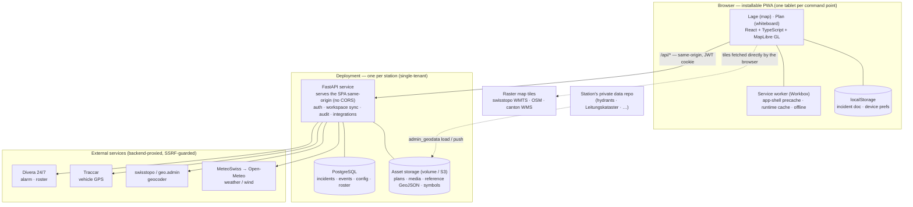
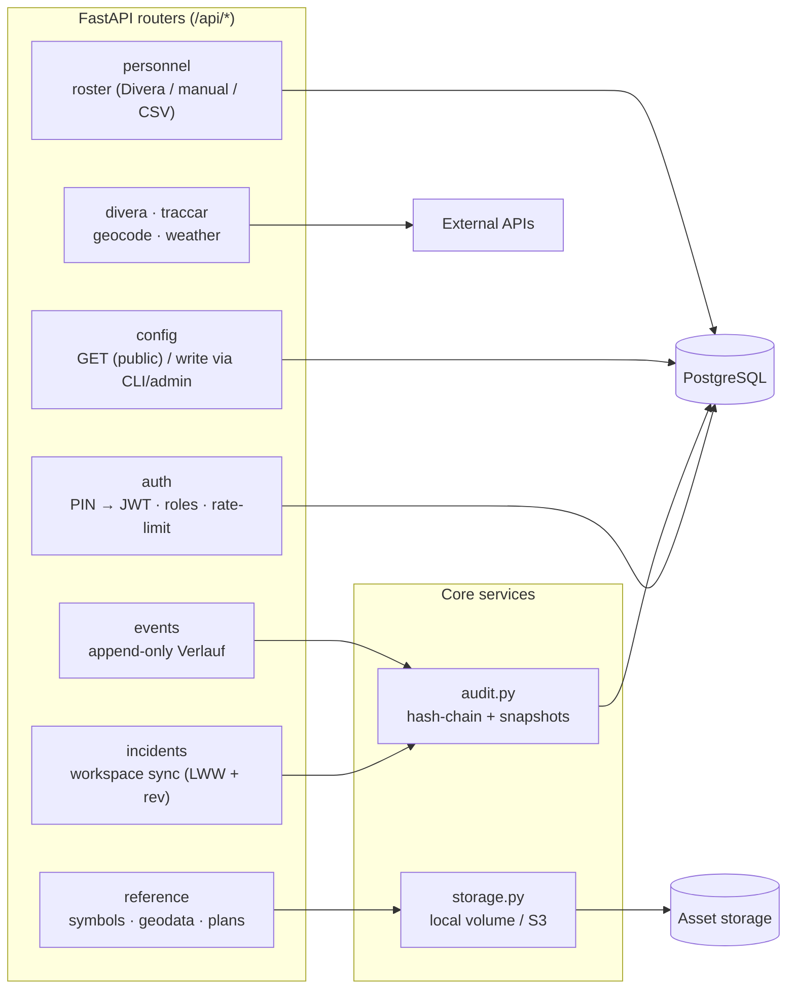
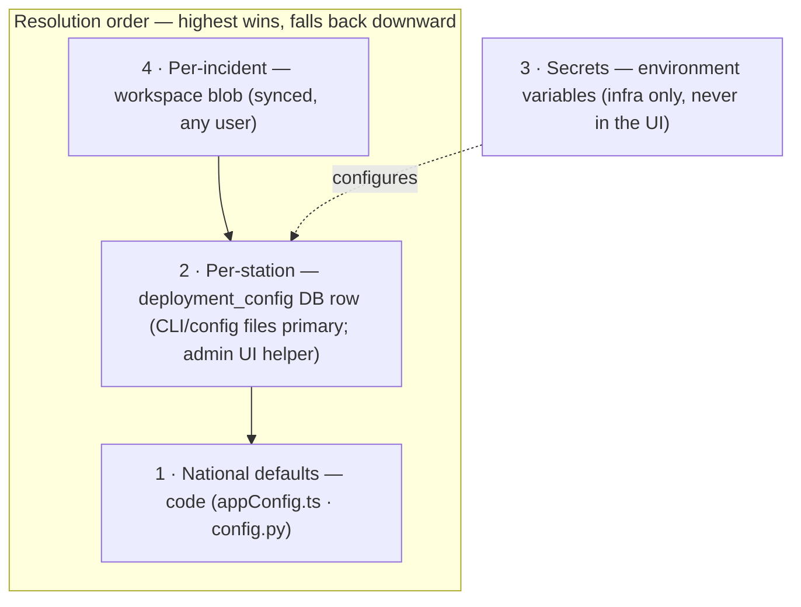
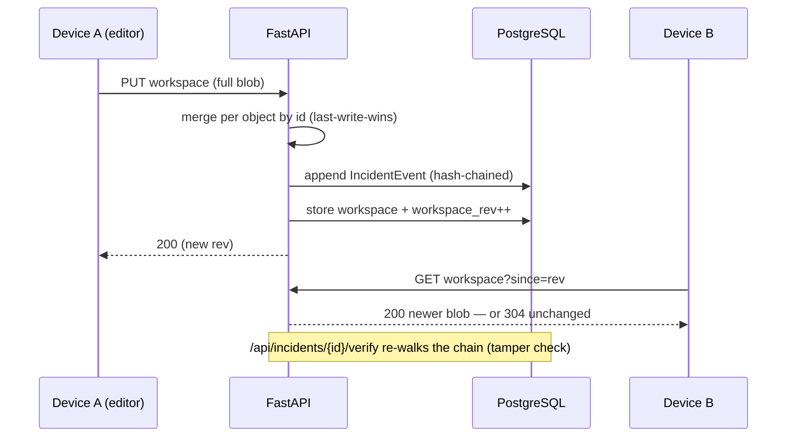
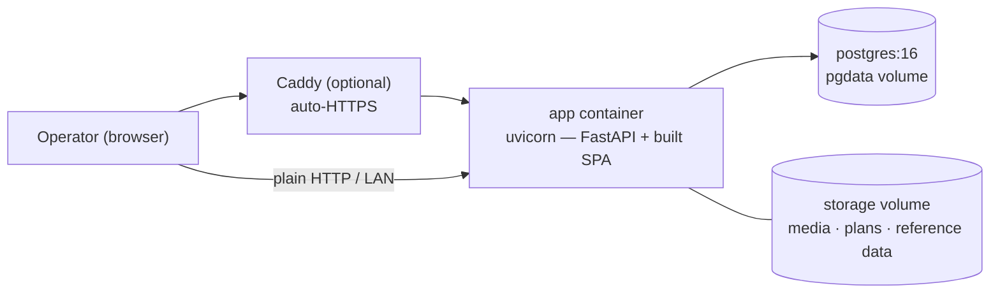

# Architecture

How KP Front is put together and where its data comes from. For the reference-geodata flow
specifically, see [`geodata-architecture.md`](geodata-architecture.md); for the per-deployment
config contract, [`CONFIGURATION.md`](CONFIGURATION.md); for running it,
[`DEPLOYMENT.md`](DEPLOYMENT.md).

The shape in one sentence: a tablet-first **PWA** talks to a single **FastAPI** service that
serves the app same-origin, owns a **PostgreSQL** database and an asset store, and is the only
thing that reaches **external services** — one deployment per station, no multi-tenancy.

## System context

## Where the data comes from

| Data | Source | How it reaches the app | Offline |
| --- | --- | --- | --- |
| Tactical symbols (FKS) | KP-Front-authored (`tools/gen_symbols.py`) | bundled `public/tactical-symbols.json`, also seeded into the reference store | ✅ cached |
| Hazmat UN-Nr → Stoff (ADR) | UNECE ADR table | bundled `src/data/unHazard.json` | ✅ in-app |
| Base map tiles | swisstopo WMTS · OSM · canton WMS | **browser fetches tile servers directly** | ⚠️ only pre-cached areas |
| Geocoding / address search | swisstopo geo.admin | backend proxy `GET /api/geocode` | ✗ online only |
| Weather / wind | MeteoSwiss → Open-Meteo fallback | backend proxy `GET /api/weather` | last value cached |
| Alarm + roster | Divera 24/7 | backend proxy `/api/divera`, `/api/personnel` | roster cached |
| Live vehicle GPS | Traccar | backend proxy `/api/traccar` | ✗ live only |
| Reference geodata (hydrants, Leitungskataster, canton WMS) | the station's own (often private) data repo | `admin_geodata` → reference store + `config.referenceLayers` (see [`geodata-architecture.md`](geodata-architecture.md)) | ✅ GeoJSON cached (WMS tiles online) |
| Incident state · Verlauf · exports | **the operator (this app)** | workspace sync + append-only event log in Postgres | ✅ localStorage + queued sync |

Three classes: **bundled** (offline, ships in the app), **backend-proxied** (cached, one
SSRF-guarded client per service), and **browser-direct** (raster tiles only). No station data
is bundled — see the geodata doc for why.

## Backend modules

Auth is a PIN-kiosk login issuing JWTs in httpOnly cookies. Product roles are **editor** (FU /
incident editing) and **viewer** (read-only); the stored backend value was migrated from the
legacy `commander` name to `editor` on 2026-06-30. Deployment
administration should be separated behind env-var-backed admin auth instead of piggybacking on the
incident editor role.
Incident state is one workspace blob per incident; the audit trail (`audit.py`) hash-chains
every change and keeps fold snapshots so an incident can be replayed and verified
(`GET /api/incidents/{id}/verify`).

## Configuration: four layers

A station's config is a single `deployment_config` row served at `GET /api/config` and applied
at boot to override the code defaults. Edit it as code with
`uv run python -m app.admin_config <schema|example|validate|diff|load>`. See
[`CONFIGURATION.md`](CONFIGURATION.md).

## Sync & audit flow

The browser also keeps the incident in `localStorage` and queues writes while offline, so the
app keeps working without connectivity and reconciles on reconnect.

## Deployment

One image, built in two stages (Vite SPA → `dist/`, then the FastAPI app that serves it),
running next to PostgreSQL; an optional Caddy container terminates TLS. Runs on Railway or
self-hosted via docker-compose. Full guide in [`DEPLOYMENT.md`](DEPLOYMENT.md).

## Why it's shaped this way

- **Single service, same-origin** → no CORS, cookies stay httpOnly/SameSite, one thing to
  deploy and back up.
- **Single-tenant (one deployment per station)** → data isolation is trivial; config is one row.
- **Backend is the only egress** → external API credentials never touch the browser, and every
  outbound call is SSRF-guarded and cacheable.
- **Append-only, hash-chained history** → the incident record is tamper-evident and replayable,
  suitable as a legal record.
- **Bundle nothing station-specific** → clean open-source posture; each station brings its own
  branding, config, and geodata.
