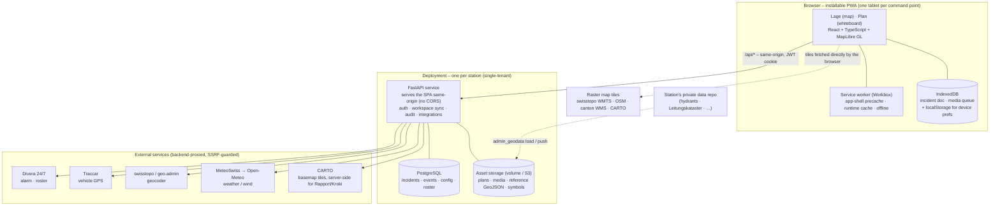
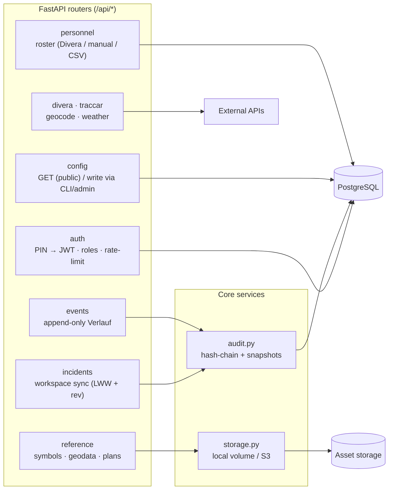
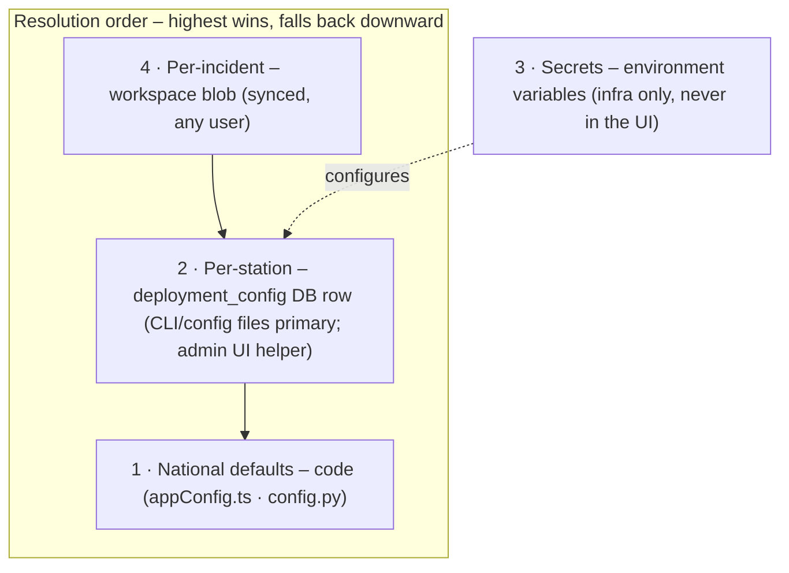
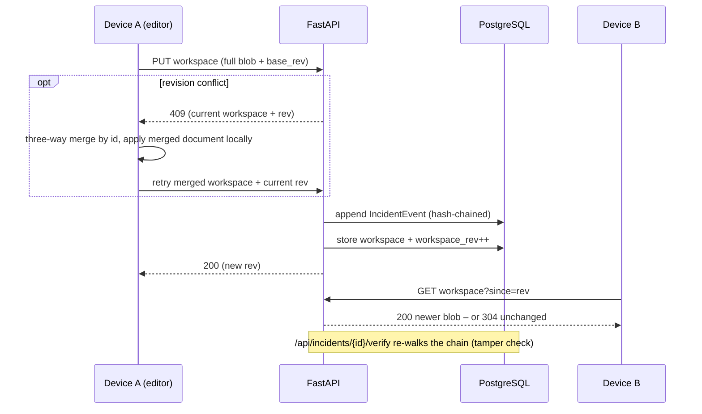
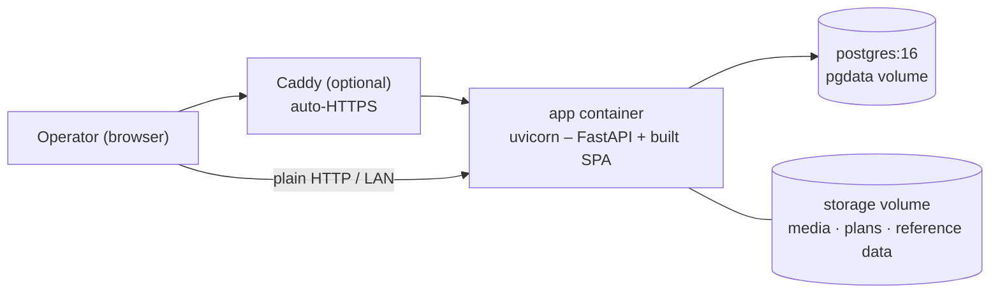

# Architecture

How KP Front is put together and where its data comes from. For the reference-geodata flow
specifically, see [`geodata-architecture.md`](geodata-architecture.md); for the per-deployment
config contract, [`CONFIGURATION.md`](CONFIGURATION.md); for running it,
[`DEPLOYMENT.md`](DEPLOYMENT.md).

The shape in one sentence: a tablet-first **PWA** talks to a single **FastAPI** service that
serves the app same-origin, owns a **PostgreSQL** database and an asset store, and is the only
thing that reaches **external services** – one deployment per station, no multi-tenancy.

## System context

```mermaid
flowchart TB
  subgraph CLIENT["Browser – installable PWA (one tablet per command point)"]
    UI["Lage (map) · Plan (whiteboard)<br/>React + TypeScript + MapLibre GL"]
    SW["Service worker (Workbox)<br/>app-shell precache · runtime cache · offline"]
    LS[("IndexedDB<br/>incident doc · media queue<br/>+ localStorage for device prefs")]
    UI --- SW
    UI --- LS
  end

  subgraph DEP["Deployment – one per station (single-tenant)"]
    API["FastAPI service<br/>serves the SPA same-origin (no CORS)<br/>auth · workspace sync · audit · integrations"]
    DB[("PostgreSQL<br/>incidents · events · config · roster")]
    FILES[("Asset storage (volume / S3)<br/>plans · media · reference GeoJSON · symbols")]
    API --- DB
    API --- FILES
  end

  subgraph EXT["External services (backend-proxied, SSRF-guarded)"]
    DIV["Divera 24/7<br/>alarm · roster"]
    TRC["Traccar<br/>vehicle GPS"]
    GEO["swisstopo / geo.admin<br/>geocoder"]
    WX["MeteoSwiss → Open-Meteo<br/>weather / wind"]
    CARTO["CARTO<br/>basemap tiles, server-side for Rapport/Kroki"]
  end

  TILES["Raster map tiles<br/>swisstopo WMTS · OSM · canton WMS · CARTO"]
  PRIV["Station's private data repo<br/>(hydrants · Leitungskataster · …)"]

  UI -->|"/api/* – same-origin, JWT cookie"| API
  API --> DIV
  API --> TRC
  API --> GEO
  API --> WX
  API --> CARTO
  UI -. "tiles fetched directly by the browser" .-> TILES
  PRIV -. "admin_geodata load / push" .-> FILES
```

## Where the data comes from

| Data | Source | How it reaches the app | Offline |
| --- | --- | --- | --- |
| Tactical symbols (FKS) | KP-Front-authored (`tools/gen_symbols.py`) | bundled `public/tactical-symbols.json`, also seeded into the reference store | ✅ cached |
| Hazmat UN-Nr → Stoff (ADR) | UNECE ADR table | bundled `src/data/unHazard.json` | ✅ in-app |
| Base map tiles | swisstopo WMTS · OSM · canton WMS | **browser fetches tile servers directly** | ⚠️ pre-cached areas only – a per-device setting (Offline-Vorbereitung) can pre-cache automatically shortly after an incident opens, instead of relying on the manual «Alles für offline laden» |
| Geocoding / address search | swisstopo geo.admin | backend proxy `GET /api/geocode` | ✗ online only |
| Weather / wind | MeteoSwiss → Open-Meteo fallback | backend proxy `GET /api/weather`; recorded by the scheduler (`weather.observe`) | last value cached |
| Alarm + roster | Divera 24/7 | webhook + the scheduler's poll → pool; devices read `/api/divera/pool`, `/api/personnel` | roster cached |
| Live vehicle GPS | Traccar | backend proxy `/api/traccar` (one cached answer per 10 s); «vor Ort»/«verlassen» observed by the scheduler | ✗ live only |
| Reference geodata (hydrants, Leitungskataster, canton WMS) | the station's own (often private) data repo | `admin_geodata` → reference store + `config.referenceLayers` (see [`geodata-architecture.md`](geodata-architecture.md)) | ✅ GeoJSON cached (WMS tiles online) |
| Incident state · Verlauf · exports | **the operator (this app)** | workspace sync + append-only event log in Postgres | ✅ IndexedDB + queued sync |

Three classes: **bundled** (offline, ships in the app), **backend-proxied** (cached, one
SSRF-guarded client per service), and **browser-direct** (raster tiles only). No station data
is bundled – see the geodata doc for why.

## Backend modules

```mermaid
flowchart LR
  subgraph EDGE["FastAPI routers (/api/*)"]
    AUTH["auth<br/>PIN → JWT · roles · rate-limit"]
    INC["incidents<br/>workspace sync (LWW + rev)"]
    EVT["events<br/>append-only Verlauf"]
    CFG["config<br/>GET (public) / write via CLI/admin"]
    REF["reference<br/>symbols · geodata · plans"]
    PERS["personnel<br/>roster (Divera / manual / CSV)"]
    INTEG["divera · traccar<br/>geocode · weather"]
  end

  subgraph CORE["Core services"]
    AUD["audit.py<br/>hash-chain + snapshots"]
    STG["storage.py<br/>local volume / S3"]
  end

  DB[("PostgreSQL")]
  FILES[("Asset storage")]
  EXTSVC["External APIs"]

  AUTH --> DB
  INC --> AUD --> DB
  EVT --> AUD
  CFG --> DB
  PERS --> DB
  REF --> STG --> FILES
  INTEG --> EXTSVC
```

Auth is a PIN-kiosk login issuing JWTs in httpOnly cookies. Product roles are **editor** (FU /
incident editing), **el** (Einsatzleiter function, added 2026-09-07: full read, but writes only
the operational record – Anwesenheit/Zeitplan, Mittel, Checklisten, Rapport + Beilagen –
through a server-enforced workspace slice; the tactical picture stays editor-only) and
**viewer** (read-only); the stored backend value was migrated from the
legacy `commander` name to `editor` on 2026-06-30. Deployment administration is separated
behind its own `ADMIN_SECRET` env var: the `/admin` UI and admin-write API (config, branding,
system, user CRUD, geodata/objects) gate on a secret-backed admin-session cookie, never on the
incident editor role, and it is fail-closed – an unset `ADMIN_SECRET` returns 403 on every
admin endpoint rather than falling back to the editor PIN.
Incident state is one workspace blob per incident; the audit trail (`audit.py`) hash-chains
every change and keeps fold snapshots so an incident can be replayed and verified
(`GET /api/incidents/{id}/verify`).

### The server observes; devices never write observations

Everything the app merely OBSERVES about the outside world is recorded by the scheduler (one
leader per deployment, `scheduler.py` · PostgreSQL advisory lock), once, stamped with the time
the fact is about — never by a device. Decided after the Feueralarm-Übung of 23.09.2026, where
every editor device wrote what it noticed, when it noticed: all five vehicles «vor Ort» at
19:43 (the moment a tablet woke up; GPS said 19:23–19:28), one weather reading up to five
times, and 469 Divera polls.

The observer is **active** for an incident that is open, started within the last 24 h and has
a real coordinate (not 0/0); Übungen included.

| Observation | Where | Record |
| --- | --- | --- |
| Fahrzeug «vor Ort» / «verlassen» | `vehicle_presence.py`, inside the 30 s GPS sweep (`_vehicle_samples_sweep`); rings ≤ 150 m / ≥ 300 m, 90 s settle, stamped with the FIRST GPS fix in the new zone | a `vehicle.presence` audit event per transition (`vp:<device>:<n>`, the restart memory); Verlauf rows for the first arrival and the last departure only (`vp-<n>-<zone>-gps-<device>`, the departure once the vehicle stayed away 20 min or the incident ends); `reportMeta.fahrzeuge[].gps` (zone, an, ab, Fahrten) for the vehicle table and the Rapport; `vorOrt`/`zurueck` first-writer-wins against the external geofence (`api/alarms · apply_milestones`) |
| Wetter | `observations.py`, every 10 min (`_weather_sweep`) | one `weather.observe` event per reading, `wx:<incident>:<observed_at>` (the shape the replay reads) |
| Winddrehung | `observations.py` — ≥ 45° at ≥ 10 km/h, held over two readings | one Verlauf row `wxd-<observed_at>`; devices show it once on the Meldeleiste |
| Divera-Alarme | `_divera_tick`: 30 s while no incident runs, 120 s while one does, exponential back-off on 429 | the pool; the webhook stays the primary intake, devices only READ `/api/divera/pool` |
| Fahrzeugpositionen | `traccar.cached_vehicle_positions`: one Traccar answer per 10 s for every device | — (the map's live layer) |

A derived id makes a second writer (a restart, a rolling deploy) converge rather than
duplicate. A device on an older build still writes its own presence rows and weather events;
the journal and events endpoints acknowledge and drop them (`api/journal · observed_by_server`,
`api/events · SERVER_OBSERVED_OPS`). The fake fleet (`TRACCAR_FAKE`) feeds the same sweep, so
all of it runs on dev and demo data.

## Configuration: four layers

```mermaid
flowchart TB
  subgraph PREC["Resolution order – highest wins, falls back downward"]
    direction TB
    L4["4 · Per-incident – workspace blob (synced, any user)"]
    L2["2 · Per-station – deployment_config DB row (CLI/config files primary; admin UI helper)"]
    L1["1 · National defaults – code (appConfig.ts · config.py)"]
    L4 --> L2 --> L1
  end
  L3["3 · Secrets – environment variables (infra only, never in the UI)"]
  L3 -. "configures" .-> L2
```

A station's config is a single `deployment_config` row served at `GET /api/config` and applied
at boot to override the code defaults. Edit it as code with
`uv run python -m app.admin_config <schema|example|validate|diff|load>`. See
[`CONFIGURATION.md`](CONFIGURATION.md).

## Sync & audit flow

```mermaid
sequenceDiagram
  participant A as Device A (editor)
  participant API as FastAPI
  participant DB as PostgreSQL
  participant B as Device B
  A->>API: PUT workspace (full blob + base_rev)
  opt revision conflict
    API-->>A: 409 (current workspace + rev)
    A->>A: three-way merge by id, apply merged document locally
    A->>API: retry merged workspace + current rev
  end
  API->>DB: append IncidentEvent (hash-chained)
  API->>DB: store workspace + workspace_rev++
  API-->>A: 200 (new rev)
  B->>API: GET workspace?since=rev
  API-->>B: 200 newer blob – or 304 unchanged
  Note over API,DB: /api/incidents/{id}/verify re-walks the chain (tamper check)
```

The browser also keeps the incident in **IndexedDB** (`src/lib/idb.ts`; localStorage is only a
fallback for small device preferences) and queues writes while offline, so the
app keeps working without connectivity and reconciles on reconnect.

Workspace writes, journal rows and client audit events have separate durable queues. The
shared saved indicator combines all three: it cannot turn green while one queue still has
pending or rejected work. Failed local persistence is reported separately from failed upload.
The journal offers one recovery notice with retry and a JSON export of unsent entries.

Client audit events use a stable `client_id`, unique within an incident. The server serializes
appends under the incident row lock and returns the existing event for an identical retry;
reusing an ID for different content or authorship fails the whole batch. The hash chain remains
unchanged. Events without an ID retain legacy append behavior. The browser queue is scoped to
incident and actor, survives reload, and removes events only after an acknowledged response;
teardown beacons may safely be delivered again. Journal rows retain their existing idempotent IDs.

Tab promotion reloads the previous writer's IndexedDB queue before persisting. Initial cache
reads merge entries captured while the read was in flight. Legacy localStorage migrations
remove their source only after IndexedDB confirms the replacement write.

Alarm-bearing workspace fields are validated at the shared save boundary against the stored
incident. Unchanged malformed legacy rows are retained, so an unrelated edit can still save;
new or changed invalid rows are rejected. Revision conflicts remain conflicts, and no save
bypasses drawing sanitization or alarm validation.

## Deployment

One image, built in two stages (Vite SPA → `dist/`, then the FastAPI app that serves it),
running next to PostgreSQL; an optional Caddy container terminates TLS. Runs on Railway or
self-hosted via docker-compose. Full guide in [`DEPLOYMENT.md`](DEPLOYMENT.md).

```mermaid
flowchart LR
  USER["Operator (browser)"]
  CADDY["Caddy (optional)<br/>auto-HTTPS"]
  APP["app container<br/>uvicorn – FastAPI + built SPA"]
  PG[("postgres:16<br/>pgdata volume")]
  VOL[("storage volume<br/>media · plans · reference data")]
  USER --> CADDY --> APP
  USER -->|"plain HTTP / LAN"| APP
  APP --> PG
  APP --- VOL
```

## Why it's shaped this way

- **Single service, same-origin** → no CORS, cookies stay httpOnly/SameSite, one thing to
  deploy and back up.
- **Single-tenant (one deployment per station)** → data isolation is trivial; config is one row.
- **Backend is the only egress** → external API credentials never touch the browser, and every
  outbound call is SSRF-guarded and cacheable.
- **Append-only, hash-chained history** → the incident record is tamper-evident and replayable,
  suitable as a legal record.
- **The server observes, devices never write observations** → a vehicle's arrival, the weather
  and a new Divera alarm are facts about the world, not about a screen: one writer, stamped with
  the time of the fact, whether or not any device is awake (see above).
- **Bundle nothing station-specific** → clean open-source posture; each station brings its own
  branding, config, and geodata.
