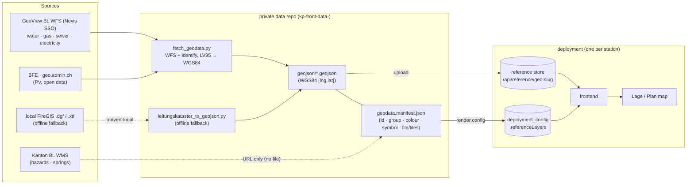
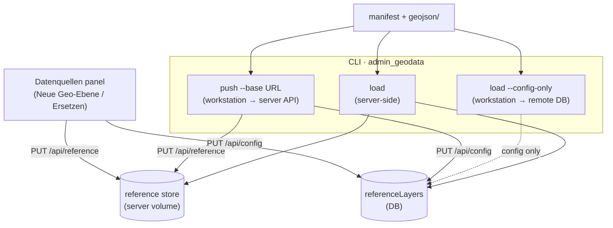
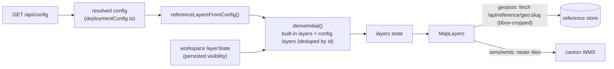

# Geodata architecture

How per-station reference geodata (hydrants, Leitungskataster, canton WMS, …) flows from
external sources into the map. The governing rule: **no station data lives in this repo.** The
app ships only base maps + operational Lage layers; everything else is loaded into a deployment
at runtime from a station's own (often private) data.

See also [`CONFIGURATION.md`](CONFIGURATION.md) §2 (layer schema) and §9c (the `admin_geodata`
CLI). Restricted utility cadastre (gas/electricity/water/sewer) is held under data-sharing
agreements — it stays in a **private data repo**, never here.

## End to end

`just update` in the private repo runs the left half (fetch → validate → push); the deployment
serves the right half. `fetch_geodata.py` is the source-of-truth pull (GeoView BL WFS +
federal PV); `leitungskataster_to_geojson.py` is an offline fallback from local FireGIS files.
WMS layers carry only a tile-URL in the manifest — no file is stored.

## Ingest — three ways in, two things written

Every path writes the same two things: the **GeoJSON file** (→ reference store) and the **render
config** (→ `deployment_config.referenceLayers`). They differ in *where they run* and *what they
touch*, because file writes land on whatever host runs the code.

| Path | Runs | Files? | Config? | Use when |
| --- | --- | --- | --- | --- |
| `load` | **server-side** (storage = the server volume) | ✅ | ✅ | first seeding a deployment from a shell that has the data |
| `load --config-only` | workstation → remote DB | — | ✅ | files already on the server; you only changed colours/labels/groups |
| `push --base URL` | workstation → server **API** (editor PIN today; deployment-admin auth target) | ✅ | ✅ | **refresh a live deployment's data** from your machine (`just push`) |
| Datenquellen UI | browser → server API | ✅ (one file) | ✅ | ad hoc inspection/basic edit: add/replace a single layer in the running app |

**The storage caveat (why `push` and `--config-only` exist):** a plain `load` writes the GeoJSON
to its *local* `MEDIA_STORAGE_DIR`. Run from a laptop against a remote DB it would point the
DB rows at files the server can't see. So from a workstation: `push` (files go through the API,
server writes its own volume) or `--config-only` (touch config only). GeoJSON is validated as a
**WGS84 `[lng,lat]`** FeatureCollection — LV95-looking coordinates are rejected at every entry.

## Runtime render

At boot the frontend fetches `/api/config`, turns `referenceLayers` into `LayerDef`s, and merges
them with the built-in base + operational layers (`deriveInitial`). Because a layer's **`id`** is
the key for persisted `layerState`, the same ids in the manifest mean a station's saved layer
visibility carries across a data refresh. GeoJSON layers fetch from the reference store
(bbox-cropped to the incident); WMS/WMTS layers draw raster tiles straight from the canton.

## Why it's shaped this way

- **No station data in the repo** → clean open-source, no licensing/security exposure; each
  station brings its own data via the manifest.
- **Single-tenant** (one deployment = one station) → config is a single `deployment_config` row;
  no per-tenant layer scoping.
- **Manifest = one contract** → the same file drives the CLI, the API push, and documents the
  render config; `id`s tie data, config, and persisted visibility together.
