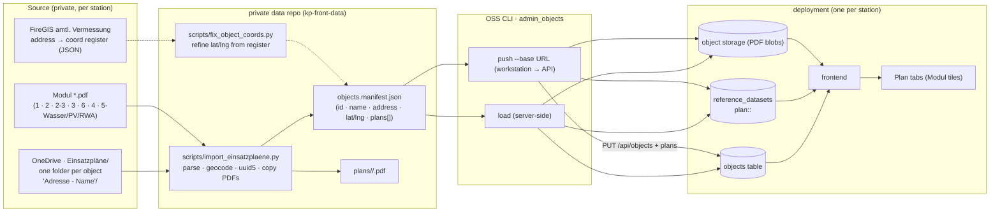
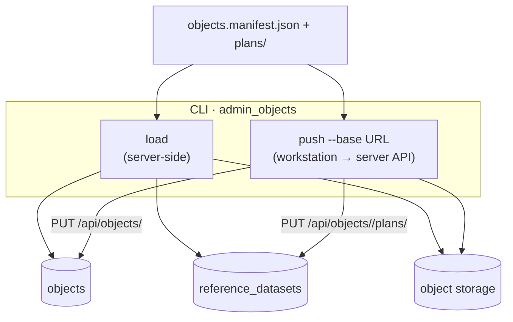
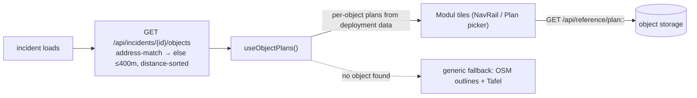

# Objektpläne (Einsatzpläne) architecture

How the brigade's pre-planned **Einsatzobjekte** (object sites) and their **Modul-PDFs**
(Übersicht, Umgebung, Objektplan, Gebäudepläne, Löschwasser/PV/…) flow from the OneDrive plan
library into the app, where they auto-surface on the map when an incident is near a known object.
The governing rule is the same as for geodata: **no station data lives in this repo.** Real
Einsatzobjekte are loaded into a deployment at runtime from the station's own private data. A
public demo instance may load synthetic objects separately, but the repository itself must not
ship plan PDFs or a public-plan fallback.

This is the **objects twin of [`geodata-architecture.md`](geodata-architecture.md)**: the
station-specific importer lives in a private data repo and produces a manifest + payload; a
generic OSS CLI ingests it. The two pipelines share the **reference store**
(`/api/reference/<id>`) and object-storage volume, but objects differ in identity scheme
(`plan:<obj>:<module>`, per-object) and how they surface (proximity to the incident, not a
toggleable map layer).

| | Geodata | Objektpläne |
| --- | --- | --- |
| Private producer | `fetch_geodata.py` → `geodata.manifest.json` + `geojson/` | `import_einsatzplaene.py` → `objects.manifest.json` + `plans/` |
| OSS CLI | `admin_geodata` (load/push/show) | `admin_objects` (load/push/show) |
| Stored as | `geo:<slug>` + `config.referenceLayers` | `ObjectSite` rows + `plan:<obj>:<module>` datasets |
| Surfaces as | map layer (toggle) | nearest object's Modul tiles on incident load |

## End to end



`import_einsatzplaene.py` (private) is the source-of-truth pull: it walks OneDrive, geocodes
(swisstopo, biased by the configured `", <Ort> <Kanton>"` locality), assigns each object a **deterministic `uuid5`** from its
folder name, copies the matched Modul-PDFs into `plans/`, and writes `objects.manifest.json`.
`fix_object_coords.py` is an optional accuracy pass that overwrites the swisstopo coordinates in
the manifest with authoritative ones from the FireGIS amtliche Vermessung register. `admin_objects`
(OSS) then ingests that manifest into a deployment.

## Ingest — one manifest, two ways in

Every path writes the same three things — an `ObjectSite` row, a `ReferenceDataset` per Modul
(`plan:<obj>:<module>`), and the PDF blob in object storage. The deterministic `uuid5` keys
everything, so reruns upsert in place rather than duplicating.



| Path | Runs | Use when |
| --- | --- | --- |
| `load <manifest>` | **server-side** (storage = the server volume) | first seeding a deployment from a shell that has the data |
| `push <manifest> --base URL` | workstation → server **API** (editor PIN today; deployment-admin auth target) | **refresh a live deployment** from your machine (`just push-objects`) |

```bash
uv run python -m app.admin_objects validate <manifest>    # parse + check every PDF exists (no DB)
uv run python -m app.admin_objects load <manifest>        # server-side: upsert objects + copy PDFs
uv run python -m app.admin_objects push <manifest> --base <url> --user-id <id> --pin <pin>
uv run python -m app.admin_objects show                   # list stored objects + plan counts
```

**The storage caveat (why `push` exists):** a plain `load` writes PDFs to its *local*
`MEDIA_STORAGE_DIR`. Run from a laptop against a remote DB it would point the rows at files the
server can't see. So from a workstation use `push` — files go through the API and the server
writes its own volume.

**Module mapping** (done by the importer in the private repo): `Modul 1`→`modul1`,
`Modul 2`→`modul2`, combined `Modul 2-3`→`modul2`, `Modul 3`→`modul3`, `Modul 6`→`modul6`.
`Modul 4` and the `Modul 5 - *` sub-sheets map to **`modul4` / `modul5-wasser` / `modul5-pv` /
`modul5-rwa`** (the sub-slot is kept distinct so Wasser/PV/RWA don't collapse onto one tile).
`Vertrag/` and `Zusatz/` subfolders are ignored.

## Runtime render — proximity surface

Unlike geodata (config-driven map layers, visible whenever switched on), Objektpläne surface
**per incident, by proximity**. There is no `referenceLayers` entry; the app asks the backend
which known object the incident sits on.



On incident load the frontend calls `GET /api/incidents/{id}/objects`, which matches first by
address then by proximity (≤400 m, distance-sorted), and `useObjectPlans()` swaps the nearest
object's Modul-PDFs into the Plan tabs. If no object is near or configured, there is **no**
public-repo plan fallback: the app offers only generic `osm` building outlines and `tafel` blank
sketch sheets. The combined `Modul 2-3` sheet collapses to a single tile. The fixed catalog
(`planDocuments`) defines tiles for `modul1/2/2-3/3/6`; **`modul4` and the `modul5-*` sub-slots
have no fixed tile — their tile is synthesized on the fly from the backend module key** (with a
German label for Wasser/PV/RWA), so whatever sub-sheets a station's library carries show up
without a code change. An editor can override the auto-pick and select another object manually.

## Refresh — getting the latest data

Objektpläne change as the brigade updates its Einsatzplan library. To refresh a deployment:

1. **Re-run the importer** in the data repo against the current OneDrive library — it rewrites
   `objects.manifest.json` + `plans/` (idempotent: deterministic `uuid5`, so objects update in
   place, new objects are added).
2. *(optional)* **`fix_object_coords.py`** if you have a refreshed authoritative register.
3. **`admin_objects push`** (or `just push-objects` in the data repo) to upload the updated set to
   the live deployment via its API.

There is no live remote `pull` (the source is OneDrive on a workstation, not a server-reachable
URL) — refresh is import-on-workstation → push-to-prod, mirroring geodata's `just push`.

## Configurable module catalog (types · labels · parsing)

The module set is **not hardcoded** — one config in `deployment_config.modules` declares each
module's **type** (`id`), **label** (`code` like `M1` / `2/3`, plus `title`/`subtitle`/`order`/
`orientation`), and **parsing rule** (`match` regex on the source filename, `combinedWith` for a
combined sheet, `family` for a generative sub-slot). The same list drives **both** ends:

- **App** (`modulesFromConfig()` in `deploymentConfig.ts` → `useObjectPlans`) renders the plan
  tiles from it (falling back to the bundled module entries; OSM/Tafel surfaces stay app-defined,
  Modul 4/5 sub-sheets still synthesize data-driven tiles from the backend).
- **Importer** (`import_einsatzplaene.py`) loads the **same** `modules` — via `--modules <file>`,
  else the live deployment (`KP_BASE_URL` → `GET /api/config`), else its `BUILTIN_MODULES` default
  — and parses filenames with the `match`/`combinedWith`/`family` rules. The built-in reproduces
  the canonical mapping exactly (verified: 0 slot mismatches over 154 objects).

Edit it as code with the config CLI and upload via the same path as any config:
`cd backend && uv run python -m app.admin_config <example|validate|load>` (`example` prints a
populated `modules` block). **CLI upload of everything**: `admin_config load <config>` (catalog +
all config) → `import_einsatzplaene` (rebuilds manifest+plans using that catalog) →
`admin_objects push` (objects + PDFs). Oversized scans are auto-compressed to fit the upload cap.

## Why it's shaped this way

- **No station data in the repo** → same open-source / licensing posture as geodata; the OSS CLI
  is generic, the OneDrive-specific importer lives with the station's data. Public demo data is
  loaded into a separate demo deployment, not bundled here.
- **Deterministic `uuid5` per folder** → idempotent, resumable refreshes with no DB roundtrip and
  no duplicated objects on rerun (matches the repo's prefixed-timestamp / no-UUID-churn ID ethos).
- **Per-object + proximity, not a map layer** → an object's plans are only relevant when the
  incident is *at* that object; surfacing the nearest one (≤400 m) is recognition-over-recall at
  3am, with no layer to remember to switch on.
- **Data-driven Modul 4/5 tiles** → the sub-sheet set varies per station and per object; deriving
  tiles from the data avoids hardcoding a list the OSS repo can't see.
