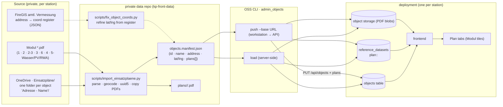
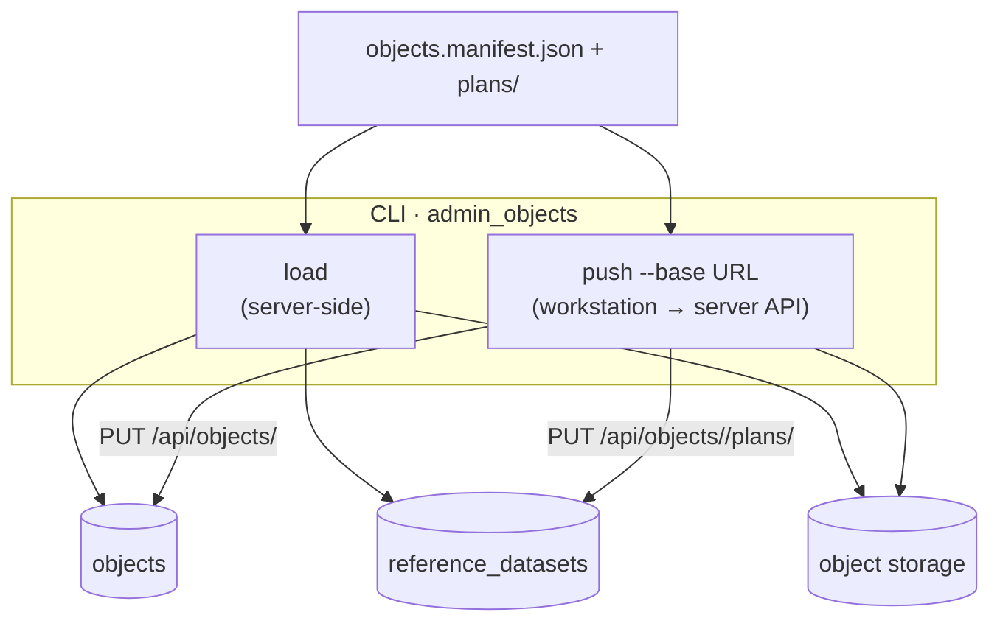
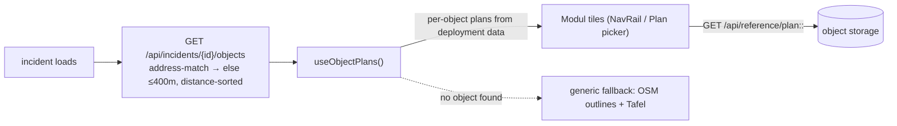
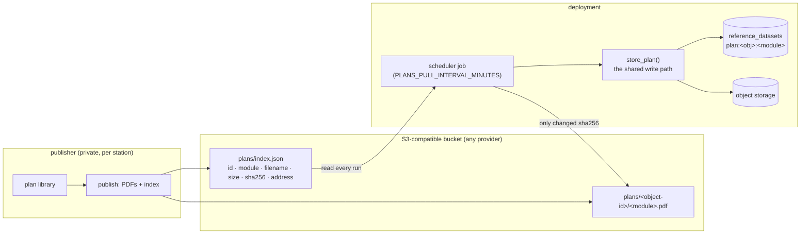

# Objektpläne (Einsatzpläne) architecture

How the brigade's pre-planned **Einsatzobjekte** (object sites) and their **Modul-PDFs**
(Übersicht, Umgebung, Objektplan, Gebäudepläne, Löschwasser/PV/…) flow from the OneDrive plan
library into the app, where they auto-surface on the map when an incident is near a known object.
The governing rule is the same as for geodata: **no station data lives in this repo.** Real
Einsatzobjekte are loaded into a deployment at runtime from the station's own private data. A
public demo instance may load synthetic objects separately, but the repository itself must not
ship plan PDFs or a public-plan fallback.

This is the **objects twin of [`geodata-architecture.md`](geodata-architecture.md)**: the
station-specific importer lives in a private data repo and produces a manifest + payload; a
generic OSS CLI ingests it. The two pipelines share the **reference store**
(`/api/reference/<id>`) and object-storage volume, but objects differ in identity scheme
(`plan:<obj>:<module>`, per-object) and how they surface (proximity to the incident, not a
toggleable map layer).

| | Geodata | Objektpläne |
| --- | --- | --- |
| Private producer | `fetch_geodata.py` → `geodata.manifest.json` + `geojson/` | `import_einsatzplaene.py` → `objects.manifest.json` + `plans/` |
| OSS CLI | `admin_geodata` (load/push/show) | `admin_objects` (load/push/show) |
| Stored as | `geo:<slug>` + `config.referenceLayers` | `ObjectSite` rows + `plan:<obj>:<module>` datasets |
| Surfaces as | map layer (toggle) | nearest object's Modul tiles on incident load |

## End to end


```mermaid
flowchart LR
  subgraph SRC["Source (private, per station)"]
    OD["OneDrive · Einsatzpläne/<br/>one folder per object<br/>'Adresse - Name'/"]
    PDFS["Modul *.pdf<br/>(1 · 2 · 2-3 · 3 · 6 · 4 · 5-Wasser/PV/RWA)"]
    REG["FireGIS amtl. Vermessung<br/>address → coord register (JSON)"]
  end

  subgraph PRIV["private data repo (kp-front-data)"]
    IMP["scripts/import_einsatzplaene.py<br/>parse · geocode · uuid5 · copy PDFs"]
    FIX["scripts/fix_object_coords.py<br/>refine lat/lng from register"]
    MAN["objects.manifest.json<br/>(id · name · address · lat/lng · plans[])"]
    PL["plans/<id>/<module>.pdf"]
  end

  subgraph OSS["OSS CLI · admin_objects"]
    LOAD["load (server-side)"]
    PUSH["push --base URL (workstation → API)"]
  end

  subgraph DEP["deployment (one per station)"]
    OBJ[("objects table")]
    RDS[("reference_datasets<br/>plan:<obj>:<module>")]
    STORE[("object storage (PDF blobs)")]
    FE["frontend"]
    MAP["Plan tabs (Modul tiles)"]
  end

  OD --> IMP --> MAN
  PDFS --> IMP --> PL
  REG -.-> FIX -.-> MAN
  MAN --> LOAD --> OBJ
  LOAD --> RDS
  LOAD --> STORE
  MAN --> PUSH -->|"PUT /api/objects + plans"| OBJ
  PUSH --> RDS
  PUSH --> STORE
  OBJ --> FE
  RDS --> FE
  STORE --> FE --> MAP
```

`import_einsatzplaene.py` (private) is the source-of-truth pull: it walks OneDrive, geocodes
(swisstopo, biased by the configured `", <Ort> <Kanton>"` locality), assigns each object a **deterministic `uuid5`** from its
folder name, copies the matched Modul-PDFs into `plans/`, and writes `objects.manifest.json`.
`fix_object_coords.py` is an optional accuracy pass that overwrites the swisstopo coordinates in
the manifest with authoritative ones from the FireGIS amtliche Vermessung register. `admin_objects`
(OSS) then ingests that manifest into a deployment.

## Ingest – one manifest, two ways in

Every path writes the same three things – an `ObjectSite` row, a `ReferenceDataset` per Modul
(`plan:<obj>:<module>`), and the PDF blob in object storage. The deterministic `uuid5` keys
everything, so reruns upsert in place rather than duplicating. (Two further ways in write through
the same function rather than a second copy of these rules: the browser – below – and the
deployment fetching plans for itself, «Pull» further down.)

> **A single object does not need a manifest.** `/admin` → **Objektpläne** creates and edits one
> Einsatzobjekt and uploads its Modul-PDFs slot by slot – the ordinary way a station adds the
> building it got sent to last week. **Nobody types a UUID:** the form takes the same human `key`
> a manifest does (`schulhaus-dorfmatt`) and hashes it to the identical `uuid5` the CLI derives
> (`uuid5(uuid5(NAMESPACE_URL, "https://kp-front.ch/einsatzobjekte"), key)`, key whitespace-collapsed
> and case-folded), showing the derived id live. So the browser and the manifest **address the
> same object**: retyping the key next year updates it from either door, and a manifest run over an
> object somebody created by hand updates it instead of duplicating it.
>
> ⚠️ **One thing the browser door does not set: `source_key`.** That column is what the scheduled
> **Pull** matches on, and only `admin_objects` writes it – `PUT /api/objects/{id}` has no field
> for it, by design or otherwise. An object created in the browser is therefore complete and
> usable for the PDFs you upload there, and **invisible to the pull**: its plans are counted as
> `skipped` on every run, with nothing on screen to say why. Running `admin_objects` over the
> same `key` afterwards repairs it in place (it sets `source_key` on the existing row) – so the
> rule is: **PDFs by hand → the browser is enough; PDFs on a timer → the object has to have come
> through `admin_objects` at least once.**
>
> The manifest stays the answer for **a library at once**, for anything an importer regenerates,
> and for a station reproduced on a second deployment.


```mermaid
flowchart TD
  MAN["objects.manifest.json + plans/"]

  subgraph A["CLI · admin_objects"]
    L1["load<br/>(server-side)"]
    L2["push --base URL<br/>(workstation → server API)"]
  end

  OBJ[("objects")]
  RDS[("reference_datasets")]
  STORE[("object storage")]

  MAN --> L1 --> OBJ
  L1 --> RDS
  L1 --> STORE
  MAN --> L2 -->|"PUT /api/objects/<id>"| OBJ
  L2 -->|"PUT /api/objects/<id>/plans/<module>"| RDS
  L2 --> STORE
```

| Path | Runs | Use when |
| --- | --- | --- |
| `load <manifest>` | **server-side** (storage = the server volume) | first seeding a deployment from a shell that has the data |
| `push <manifest> --base URL` | workstation → server **API** (the deployment's `ADMIN_SECRET`, not the editor PIN – `--admin-secret` / `KP_ADMIN_SECRET`) | **refresh a live deployment** from your machine (`just push-objects`) |

```bash
uv run python -m app.admin_objects validate <manifest>    # parse + check every PDF exists (no DB)
uv run python -m app.admin_objects load <manifest>        # server-side: upsert objects + copy PDFs
uv run python -m app.admin_objects push <manifest> --base <url> --admin-secret <ADMIN_SECRET>
uv run python -m app.admin_objects show                   # list stored objects + plan counts
```

**The storage caveat (why `push` exists):** a plain `load` writes PDFs to its *local*
`MEDIA_STORAGE_DIR`. Run from a laptop against a remote DB it would point the rows at files the
server can't see. So from a workstation use `push` – files go through the API and the server
writes its own volume.

**Module mapping** (done by the importer in the private repo): `Modul 1`→`modul1`,
`Modul 2`→`modul2`, combined `Modul 2-3`→`modul2`, `Modul 3`→`modul3`, `Modul 6`→`modul6`.
`Modul 4` and the `Modul 5 - *` sub-sheets map to **`modul4` / `modul5-wasser` / `modul5-pv` /
`modul5-rwa`** (the sub-slot is kept distinct so Wasser/PV/RWA don't collapse onto one tile).
`Vertrag/` and `Zusatz/` subfolders are ignored.

## Runtime render – proximity surface

Unlike geodata (config-driven map layers, visible whenever switched on), Objektpläne surface
**per incident, by proximity**. There is no `referenceLayers` entry; the app asks the backend
which known object the incident sits on.


```mermaid
flowchart LR
  INC["incident loads"] --> Q["GET /api/incidents/{id}/objects<br/>address-match → else ≤400m, distance-sorted"]
  Q --> HOOK["useObjectPlans()"]
  HOOK -->|"per-object plans from deployment data"| TILES["Modul tiles (NavRail / Plan picker)"]
  HOOK -. "no object found" .-> FALLBACK["generic fallback: OSM outlines + Tafel"]
  TILES -->|"GET /api/reference/plan:<obj>:<module>"| STORE[("object storage")]
```

On incident load the frontend calls `GET /api/incidents/{id}/objects`, which matches first by
address then by proximity (≤400 m, distance-sorted), and `useObjectPlans()` swaps the nearest
object's Modul-PDFs into the Plan tabs. If no object is near or configured, there is **no**
public-repo plan fallback: the app offers only generic `osm` building outlines and `tafel` blank
sketch sheets. The combined `Modul 2-3` sheet collapses to a single tile. The fixed catalog
(`planDocuments`) defines tiles for `modul1/2/2-3/3/6`; **`modul4` and the `modul5-*` sub-slots
have no fixed tile – their tile is synthesized on the fly from the backend module key** (with a
German label for Wasser/PV/RWA), so whatever sub-sheets a station's library carries show up
without a code change. An editor can override the auto-pick and select another object manually.

## Refresh – getting the latest data

Objektpläne change as the brigade updates its Einsatzplan library. To refresh a deployment:

1. **Re-run the importer** in the data repo against the current OneDrive library – it rewrites
   `objects.manifest.json` + `plans/` (idempotent: deterministic `uuid5`, so objects update in
   place, new objects are added).
2. *(optional)* **`fix_object_coords.py`** if you have a refreshed authoritative register.
3. **`admin_objects push`** (or `just push-objects` in the data repo) to upload the updated set to
   the live deployment via its API.

That is refresh by **push**: import-on-workstation → push-to-prod, mirroring geodata's `just
push`. A deployment whose plan library is maintained by another system can also **pull** –
next section.

### Pin the bytes you mean to publish

A plan entry may carry a **`sha256`** (lower-case hex of the PDF). Where it is set, `validate`,
`load` and `push` all refuse to publish anything else under that module — and they say what
they found:

```json
{ "module": "modul1", "file": "plans/schloss/modul1.pdf",
  "sha256": "8ea2bc8f…", "title": "Schloss – Übersicht" }
```

⚠️ This is a **wrong-tree** check, not a corruption check. A manifest is published from
whichever checkout runs the script, so a stale worktree quietly republishes whatever PDFs it
happens to hold: on 09.08.2026 the public demo went back to generated placeholders — and to a
Modul 6 retired the day before — because a reset ran from a tree that predated the drawn
sheets. Nothing failed, and the demo simply served the old plans until somebody noticed. The
pull's `index.json` has always carried a digest per plan (see below); this gives the push door
the same footing. It stays optional: a station whose library legitimately changes every week
would only be re-pinning it every week.

⚠️⚠️ **And on its own it is only half a check.** It happened *again* the same evening, from a
checkout at `v0.1.0`, with the pin already in place — because an old tree carries an old
manifest **and** an old `admin_objects`. The digest and the code that checks it go stale
together, so this half only ever catches a *current* manifest sitting beside a *stale* PDF. A
guard that ships inside the artifact it guards cannot see past the artifact.

### The half that holds: the server refuses

The one participant in a publish that can never be the stale one is the deployment. So the
publish door checks too:

| | |
| --- | --- |
| `push` **declares** a `sha256` for every plan | pinned in the manifest or not — it hashes what it is about to send |
| `PUT /api/objects/{id}/plans/{module}` **verifies** any `sha256` it is given | on every deployment, always. One hash turns a truncated or swapped upload into a `400` |
| `REQUIRE_PLAN_DIGEST` makes one **mandatory** for an *automated* publish | admin secret + no logged-in user = `admin_objects push`. A client that cannot name its own bytes is by construction older than this check, so it is refused |
| A person uploading a PDF in the admin UI is never asked | they picked the file in a dialog, in front of the plan they are replacing; they have no tree to be stale |

`REQUIRE_PLAN_DIGEST` is unset by default and derived: **on** for the public demo, **off** for a
station, so nobody's older CLI stops working because of a flag they never set. The demo is
detected via `DEMO_RESET_CRON`/`DEMO_RESET_SECONDS` and deliberately **not** via
`identity.demoMode` — demoMode lives in `deployment_config`, which is exactly what a stale
publish overwrites, and a guard the incident can switch off is not a guard.

## Pull – fetch plans instead of being pushed them

**The problem with push.** Everything above needs the deployment's `ADMIN_SECRET` at the far
end. That secret unlocks the *entire* admin API – config, branding, users, geodata, objects –
so a nightly job whose only business is uploading PDFs ends up holding a credential for
everything. For a person at a workstation that is a fair trade. For a permanently running
system somewhere else it is not: the credential outlives the task, it lives in that system's
environment, and revoking it means revoking the operator's own admin access too.

**Inverted:** the plan library publishes to an **S3-compatible bucket**, and the deployment
reads it on a schedule with a **read-only key of its own**. Nothing outside the deployment
holds a credential for it. Any S3-compatible store works – MinIO, Backblaze B2, a hosted
bucket, AWS – because endpoint, bucket, prefix, region and keys are all environment
(`PLANS_S3_*`, [`CONFIGURATION.md`](CONFIGURATION.md) §6a) and path-style addressing is all the
app assumes. Nothing about a provider is in the code.


```mermaid
flowchart LR
  subgraph PUB["publisher (private, per station)"]
    LIB["plan library"] --> UP["publish: PDFs + index"]
  end
  subgraph BKT["S3-compatible bucket (any provider)"]
    IDX["plans/index.json<br/>id · module · filename · size · sha256 · address"]
    PDF["plans/&lt;object-id&gt;/&lt;module&gt;.pdf"]
  end
  subgraph DEP["deployment"]
    JOB["scheduler job<br/>(PLANS_PULL_INTERVAL_MINUTES)"]
    SP["store_plan()<br/>the shared write path"]
    RDS[("reference_datasets<br/>plan:&lt;obj&gt;:&lt;module&gt;")]
    STORE[("object storage")]
  end
  UP --> IDX
  UP --> PDF
  IDX -->|"read every run"| JOB
  JOB -->|"only changed sha256"| PDF
  JOB --> SP --> RDS
  SP --> STORE
```

### What the bucket must contain

```text
plans/index.json                  metadata for every plan — never bytes
plans/<object-id>/<module>.pdf    the PDF itself
```

```json
{
  "generated_at": "2026-08-02T05:00:00Z",
  "plans": [
    {
      "object_id": "3f2a…-…-…",
      "folder": "schulhaus-dorfmatt",
      "module": "modul1",
      "filename": "modul1.pdf",
      "size": 4812345,
      "sha256": "9f86d081884c7d659a2feaa0c55ad015a3bf4f1b2b0b822cd15d6c15b0f00a08",
      "address_full": "Musterstrasse 1, 4104 Musterdorf"
    }
  ]
}
```

**`folder` is what a row is matched on**, and it is **required** – a row without it refuses the
whole index. It is the station's own human key for the object (`schulhaus-dorfmatt`), and it is
resolved against **`ObjectSite.source_key`**, which only `admin_objects` writes. `object_id` is
the **publisher's** id and is used for one thing: locating the bytes at
`plans/<object_id>/<filename>`. The dataset id `plan:<obj>:<module>` is then built from the
**local** object, so both doors mint the same id for the same plan. `module` is a slug from the
module catalog (`modul1`, `modul5-wasser`, …). `address_full` matches nothing; it is there so a
log line about a skipped plan names an object a human recognises.

### The rules the pull holds itself to

| Rule | Why |
| --- | --- |
| **One write path.** The pull calls the same `store_plan()` (`backend/app/plans.py`) as `PUT /api/objects/{id}/plans/{module}`. | Two doors, one ID rule. A second copy of "what is this dataset called" is how the two ends drift apart. |
| **The checksum decides.** A plan whose `sha256` matches what is stored is not downloaded at all. | A run over an unchanged library is one small GET. |
| **A bad index refuses the whole run.** Malformed JSON, a missing checksum, a duplicate entry – nothing is touched. | Ingesting the good half of a broken publish produces a half-current plan library, which is the failure nobody sees until 3am. |
| **Nothing is ever deleted.** A plan that disappears from the index stays. | The likeliest reason a plan vanishes from an index is a broken publish, not a decision. Removing a plan stays a deliberate act. |
| **The upload cap applies** (`MAX_UPLOAD_MB`), checked against the index *and* the bytes arriving. | A plan the admin UI would have rejected must not enter through the back door; a lying index must not be able to fill the disk. |
| **Only PDFs, only matching bytes.** The download must hash to what the index promised and start with `%PDF-`, or it is skipped and the existing plan kept. | An error page served with HTTP 200 is a real failure mode of object stores behind proxies. |
| **Objects are not invented.** A plan whose `folder` matches no `ObjectSite.source_key` is skipped and logged, by key. | The index carries an address, not a name or coordinates; objects come from the object path. ⚠️ An object created in the browser has **no** `source_key`, so it never matches – see the caveat under «Ingest» above. |

**Fail-closed:** with no `PLANS_S3_ENDPOINT` / bucket / key / secret the job is never scheduled
and none of this code runs – the deployment behaves exactly as it did before, and the push path
is untouched. Turning the pull on does not turn the push off; both write the same datasets, so a
station can run the two side by side while it gains confidence, then stop pushing.

**The store wins.** A plan the bucket also publishes is a plan the pull maintains: hand-upload a
correction in the admin UI and the next run replaces it with the bucket's version. Corrections
belong in the plan library, not in the deployment.

**On demand:** `POST /api/reference/plan:<obj>:<module>/fetch` (admin) pulls a single plan
immediately – same index, same validation, same write path, so the button is the mechanism
rather than a shortcut around it.

## How you know it ran — and today, mostly you don't

⚠️ **Known limitation, stated because a scheduled job that fails quietly is worse than one that
never existed.**

`pull_plans()` returns everything you would want:

```python
{"status": "disabled" | "unreachable" | "refused" | ok,
 "updated": n, "unchanged": n, "skipped": n}
```

The scheduler discards it. It logs only when `updated` is non-zero and never inspects `status`
at all, so:

| What happened | What you can observe |
| --- | --- |
| Ran, nothing changed — **the normal case** | Nothing |
| Bucket or index unreachable | A `WARNING` in the container log, and otherwise identical to the row above |
| Index invalid, whole run refused | An `ERROR` in the container log |
| Ran, plans updated | One `INFO` line |
| Every plan skipped because no objects are loaded | A log line per plan, and a deployment that simply shows no plans |

Nothing is persisted: there is no job-run record, no `last_pull_at`, no API field and no admin
UI surface. **So the honest answer to "are my plans being loaded?" is: read the container
logs** — and the healthy state is silent, which means a pull that quietly stopped working looks
exactly like one that ran and found nothing new.

Two things partly compensate, and neither is a substitute. The failure direction is safe by
construction: a refused or unreachable run leaves the deployment exactly as it was, so yesterday's
plan still opens. And the per-plan state *is* in the database if you go looking —
`reference_datasets` carries `source_type = 'snapshot'`, the upstream `source_digest` and
`updated_at` for every plan the pull wrote.

Until this is fixed, a station that relies on the pull should treat it as **needing an external
check** — the same treatment any unattended job deserves: assert that the newest
`updated_at` among `source_type = 'snapshot'` rows is younger than a couple of pull intervals,
and alert if it is not.

## Configurable module catalog (types · labels · parsing)

The module set is **not hardcoded** – one config in `deployment_config.modules` declares each
module's **type** (`id`), **label** (`code` like `M1` / `2/3`, plus `title`/`subtitle`/`order`/
`orientation`), and **parsing rule** (`match` regex on the source filename, `combinedWith` for a
combined sheet, `family` for a generative sub-slot). The same list drives **both** ends:

- **App** (`modulesFromConfig()` in `deploymentConfig.ts` → `useObjectPlans`) renders the plan
  tiles from it (falling back to the bundled module entries; OSM/Tafel surfaces stay app-defined,
  Modul 4/5 sub-sheets still synthesize data-driven tiles from the backend).
- **Importer** (`import_einsatzplaene.py`) loads the **same** `modules` – via `--modules <file>`,
  else the live deployment (`KP_BASE_URL` → `GET /api/config`), else its `BUILTIN_MODULES` default
  – and parses filenames with the `match`/`combinedWith`/`family` rules. The built-in reproduces
  the canonical mapping exactly (verified: 0 slot mismatches over 154 objects).

**The `modules` catalogue itself has no browser editor** – the Objektpläne admin page lists it and
names the CLI, and the objects and their PDFs are what you edit there. Edit the catalogue as code
with the config CLI and upload via the same path as any config:
`cd backend && uv run python -m app.admin_config <example|validate|load>` (`example` prints a
populated `modules` block; prefix with `docker compose exec app` on a Docker-only host, though a
`load` still needs the file to be somewhere the process can read it). **CLI upload of everything**:
`admin_config load <config>` (catalog +
all config) → `import_einsatzplaene` (rebuilds manifest+plans using that catalog) →
`admin_objects push` (objects + PDFs). Oversized scans are auto-compressed to fit the upload cap.

## Why it's shaped this way

- **No station data in the repo** → same open-source / licensing posture as geodata; the OSS CLI
  is generic, the OneDrive-specific importer lives with the station's data. Public demo data is
  loaded into a separate demo deployment, not bundled here.
- **Deterministic `uuid5` per folder** → idempotent, resumable refreshes with no DB roundtrip and
  no duplicated objects on rerun (matches the repo's prefixed-timestamp / no-UUID-churn ID ethos).
- **Per-object + proximity, not a map layer** → an object's plans are only relevant when the
  incident is *at* that object; surfacing the nearest one (≤400 m) is recognition-over-recall at
  3am, with no layer to remember to switch on.
- **Data-driven Modul 4/5 tiles** → the sub-sheet set varies per station and per object; deriving
  tiles from the data avoids hardcoding a list the OSS repo can't see.
